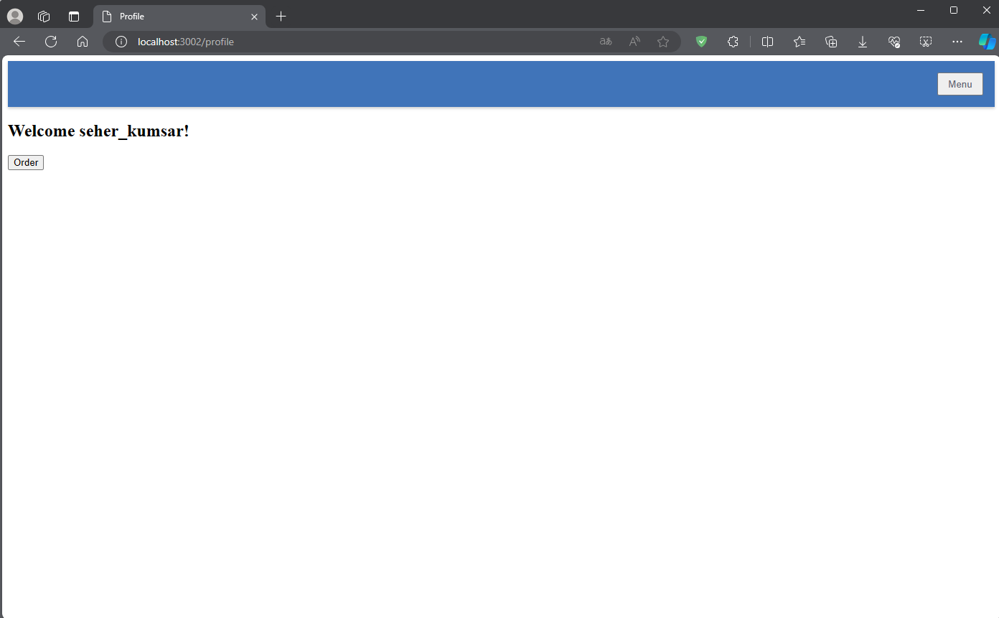

# Final Project

## Home Page


## Register Page


## Login Page


## Profile Page


## Products Page


## Orders Page


# Docker Setup

This project uses Docker to run a Node.js application with MongoDB, MySQL, and Redis.

The `docker-compose.yaml` file is used to define and manage multiple services using the Docker Compose command line tool.

## Requirements
...

## Usage

1. Clone this repository:

```
git clone https://github.com/SeherKumsar/DevOps-Akademi-Final-Project.git
```
2. Navigate to the project directory:
To run the application, you need to clone this repository and then build the image using docker-compose:
`cd app`

3. Build and start the Docker containers:
<!-- ```docker build -t final_project:v1 .``` -->
```
docker-compose up --build -d
```
Your application should now be running and connected to Rabbitmq, MongoDB, MySQL, and Redis.

To stop the application and remove the containers, use the following command:
```
docker-compose down
```

# Kubernetes Setup with Minikube

This repository contains Kubernetes YAML files to deploy various services using Minikube.

## Usage

1. Start Minikube:
`minikube start`
2. Navigate to the Kubernetes directory:
`cd k8s`
